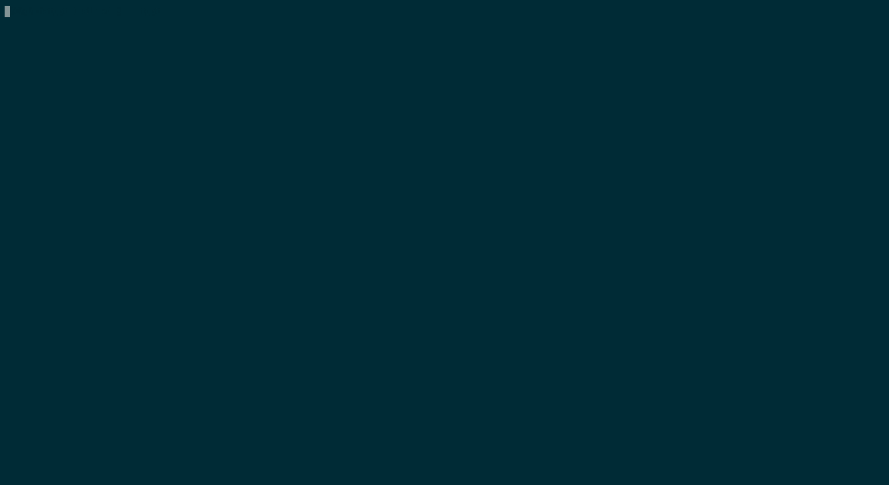

# ChatGPT Terminal UI

This is a simple terminal user interface for ChatGPT, written in Go with the [tview](https://github.com/rivo/tview) library.



ChatGPT is a chatbot that can generate human-like responses to text messages. In this terminal UI, users can send messages to ChatGPT
and receive responses from the chatbot.

## Installation

You can download the latest binary from the [release page](https://github.com/quantonganh/chatgpt/releases).

### Install via homebrew

```
brew install quantonganh/tap/chatgpt
```

### Install via go

```
go install github.com/quantonganh/chatgpt@latest
```

## Usage

- Create your API key: https://platform.openai.com/account/api-keys
- Set your `OPENAI_API_KEY` environment variable using [fish shell](https://fishshell.com/docs/current/cmds/set.html):

```shell
set -Ux OPENAI_API_KEY your-key
```

Once you have started the ChatGPT terminal UI application, you will see a text box at the bottom of the screen where you can type your messages to ChatGPT. Press the Enter key to send your message to the chatbot.

ChatGPT will respond to your message in the main area of the screen. You can continue to send messages and receive responses from the chatbot in this way.

If you want to quit the application, you can press the `ctrl-c`.

## Credits

This application was created by Quan Tong using the [tview](https://github.com/rivo/tview/) library.                                                             

ChatGPT is a product of OpenAI. For more information about ChatGPT, visit https://openai.com/.

## License

This project is licensed under the MIT License. See (LICENSE) for more information.